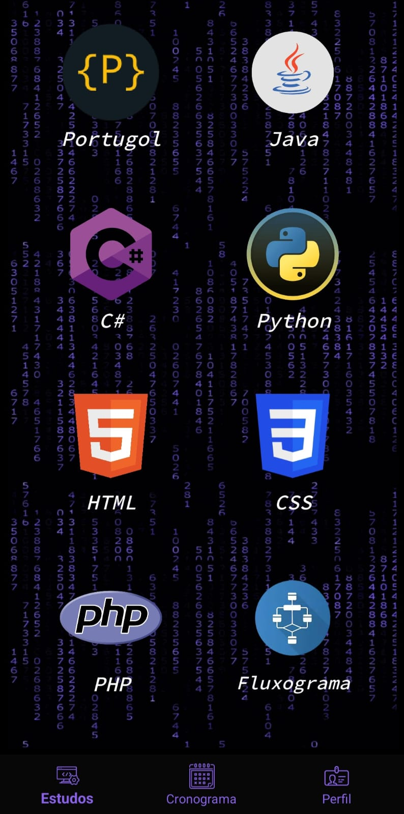
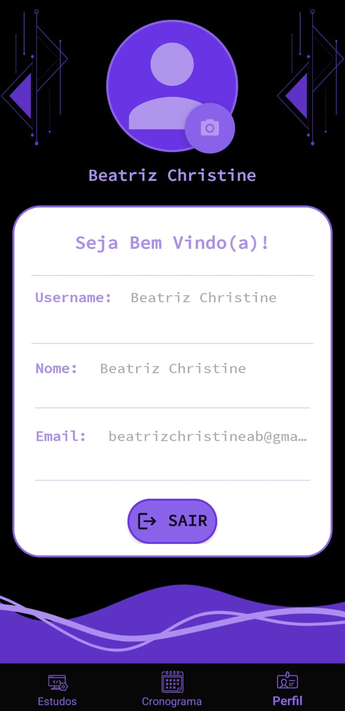
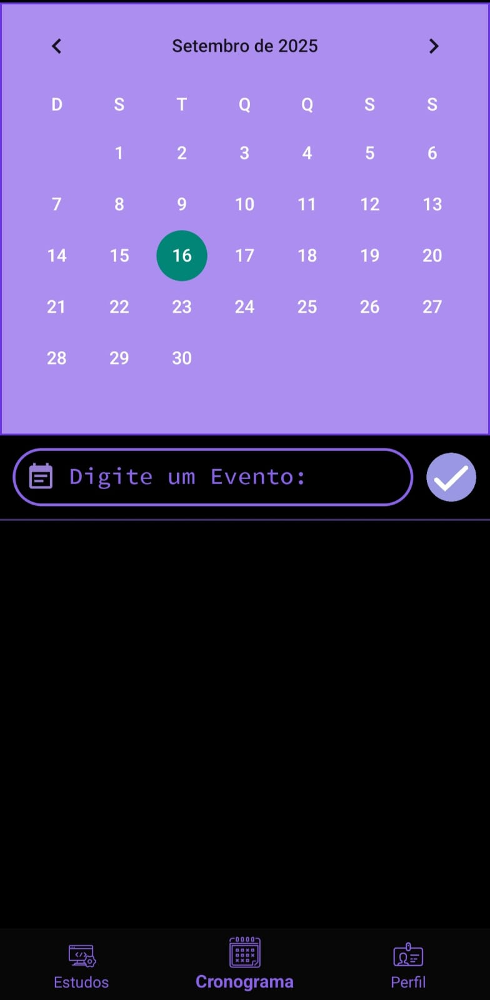
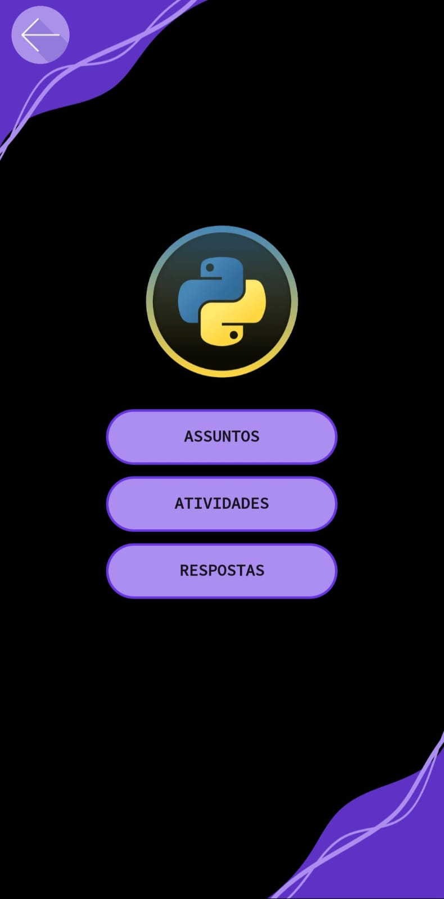

# Programa AI (Inovatech) 🚀
Aplicativo e site educativo voltados para ensino de programação e acessibilidade digital.  
Projeto premiado com **1º lugar – Melhor Pitch (Samsung Ocean, 2023)**.

## Visão Geral
O **Programa AI** é uma plataforma mobile (Android) desenvolvida para facilitar o aprendizado de lógica e programação para estudantes, integrando recursos de acessibilidade digital e organização pessoal.

## Funcionalidades
- **Material didático**: Conteúdos educativos para aprendizado de programação.  
- **Cadastro e autenticação de usuários**:
  - Login tradicional via Firebase.  
  - Login com **conta Google**, puxando dados do perfil automaticamente.  
- **Perfil do usuário**:
  - Exibição de informações do usuário (nome, e-mail, foto).  
  - Alteração de foto de perfil.  
- **Cronograma pessoal**:
  - Cadastro de eventos por data e hora.  
  - Salvamento dos eventos.  
- **Atividades e respostas**:
  - Disponibilização de atividades educativas.  
  - Registro e visualização das respostas do usuário.  
- **Integração com Firebase**:
  - Gerenciamento de dados do usuário, atividades, cronograma e autenticação.

## Stack Tecnológica
- **Android**: Java, XML  
- **Backend / Banco de Dados**: Firebase Realtime Database / Firestore  

## Como rodar (Android)
1. Clone: `git clone https://github.com/<seu-usuario>/programa-ai.git`  
2. Abra no Android Studio.  
3. Configure `google-services.json` (Firebase).  
4. Build & Run.

## 📸 Screenshots

O Programa AI oferece uma interface intuitiva e recursos completos para estudantes.  
Abaixo estão algumas telas do aplicativo:

| Tela de Login | Tela Principal | Tela de Perfil |
|---------------|----------------|----------------|
| 

 | 

 | 

 |
| Login do usuário (Firebase e Google) | Tela principal com navegação para todas funcionalidades | Perfil do usuário com dados e foto personalizável |

| Tela de Cronograma | Tela de Assuntos |
|------------------|-----------------|
| 

 | 

 |
| Cronograma com cadastro de eventos e datas | Assuntos e atividades educativas disponíveis |

## 📄 Licença
Este projeto foi desenvolvido por **Beatriz Christine Azevedo Batista**  
e está licenciado sob a **Licença MIT** — veja o arquivo [LICENSE](LICENSE) para mais detalhes.
